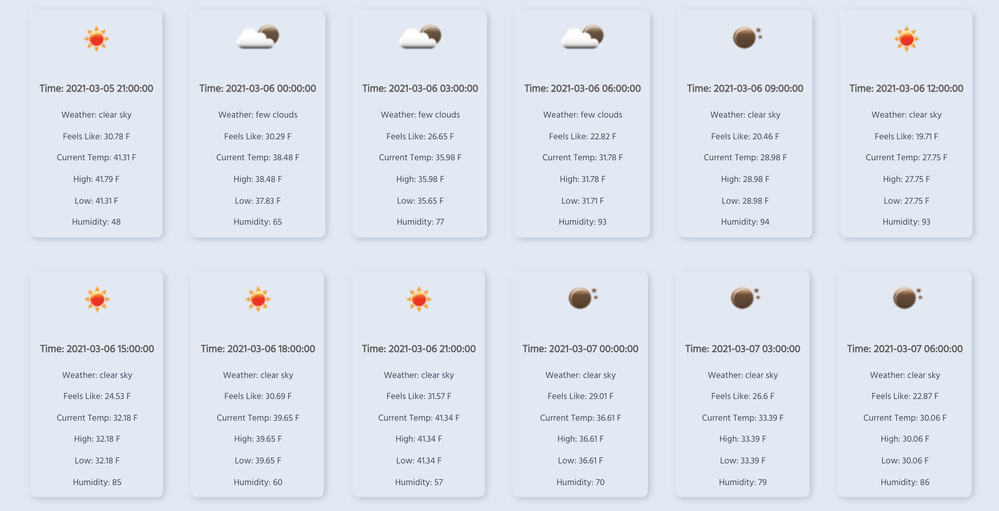

# Author: Abhi Balijepalli

## Fetching forecast data for a user-specified city

When the user submits a new city name, I make a call to the OpenWeather daily forecast API to fetch forecast data for the specified city.  You can find documentation here about how to formulate a call to the daily forecast API and about what an API response looks like:

https://openweathermap.org/forecast16

Once you receive a response from the API, parse the relevant data out of the response body, and use it to render forecast cards in your app, each of which should represent the forecast for a given day.  Each card may display as much of the weather data as you want, but at a minimum, it should display the following information:
  * The date
  * The high and low temperatures
  * The probability of precipitation
  * The short description of the day's weather
  * The appropriate icon for the day's weather.
  * Etc.

Website Render:

